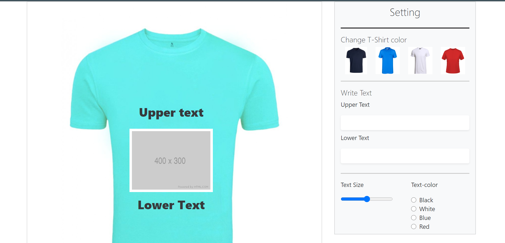

## Application screenshot



## Quick Start
### Install client dependencies

```bash
npm install
```
### Run client server

```bash
npm start
```


## App Info

### Author

Sourav59580 
[My Portfolio Website](https://sourav59580.github.io/MY_PORTFOLIO/)

### Version

1.0.0

### License

This project is licensed under the MIT License